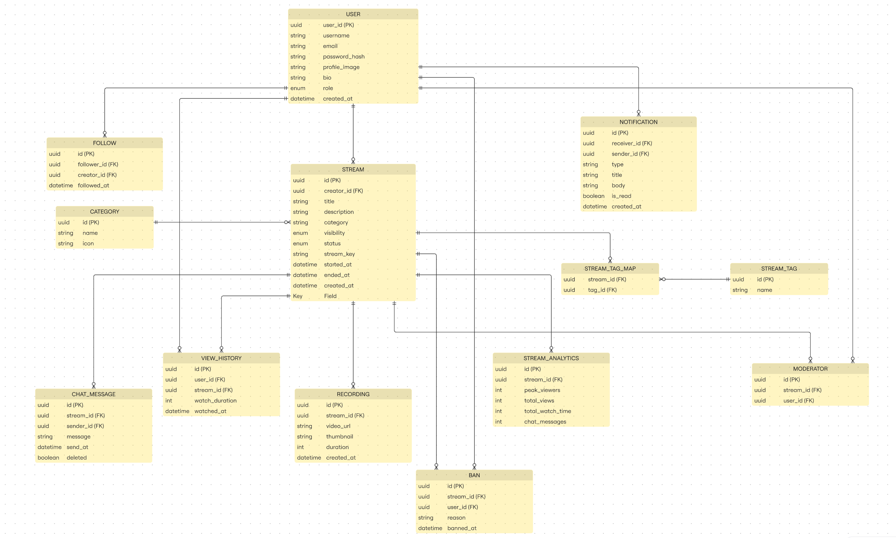

# Database Design

> **Project:** StreamLine
> **Database:** PostgreSQL
> **ORM:** Prisma
> **Status:** Draft

---

# Overview

StreamLine uses **PostgreSQL** as its primary relational database.

The database is designed to support a scalable live streaming platform with strong relational integrity, efficient querying, and future extensibility.

The schema follows the Third Normal Form (3NF) where appropriate while allowing selective denormalization for analytics and performance.

---

# Database Goals

The database is designed to achieve the following objectives:

* Maintain data consistency
* Support relational integrity
* Minimize data redundancy
* Optimize read and write performance
* Enable efficient analytics
* Support future scalability

---

# Core Entities

The system is built around the following primary entities.

```text id="c5m02n"
User
Category
Stream
Follow
ChatMessage
Recording
Notification
Moderator
ModerationLog
Analytics
```

---

# Entity Relationships

---

# Relationship Summary

| Entity               | Relationship |
| -------------------- | ------------ |
| User → Stream        | One-to-Many  |
| User → Notification  | One-to-Many  |
| User → ChatMessage   | One-to-Many  |
| User → Recording     | One-to-Many  |
| User ↔ User (Follow) | Many-to-Many |
| Stream → ChatMessage | One-to-Many  |
| Stream → Recording   | One-to-One   |
| Stream → Analytics   | One-to-One   |
| Category → Stream    | One-to-Many  |
| Moderator → User     | Many-to-One  |

---

# Naming Conventions

Tables use singular names.

Examples

```text id="w18kqg"
User
Stream
Category
Recording
```

Primary Keys

```text id="6jrmfv"
id UUID
```

Foreign Keys

```text id="srp7l7"
creatorId
streamId
categoryId
userId
```

Timestamps

```text id="up7kbc"
createdAt
updatedAt
```

---

# Data Integrity

The database enforces integrity using:

* Primary Keys
* Foreign Keys
* Unique Constraints
* Check Constraints
* Transactions
* Cascading Deletes where appropriate

---

# Indexing Strategy

Indexes should be created on frequently queried columns.

Recommended indexes:

```text id="r3gtt8"
email
username
streamKey
creatorId
categoryId
streamId
userId
createdAt
status
```

Composite indexes:

```text id="y5vxyd"
(categoryId, status)

(creatorId, createdAt)

(streamId, createdAt)

(followerId, creatorId)
```

---

# Normalization

The schema follows Third Normal Form (3NF).

Lookup data is separated into dedicated tables.

Relationships are represented through foreign keys.

Join tables are used for many-to-many relationships.

---

# Transactions

Database transactions should be used for operations involving multiple writes.

Examples:

* User Registration
* Starting a Stream
* Ending a Stream
* Follow Creator
* Assign Moderator
* Delete Account

---

# Soft Deletes

Critical entities should use soft deletes instead of permanent deletion.

Recommended columns:

```text id="im8eoq"
deletedAt
isDeleted
```

Applicable tables:

* User
* Stream
* Recording

---

# Audit Fields

Every major table should contain:

```text id="qqs6y3"
createdAt
updatedAt
```

Optional:

```text id="78bf3l"
createdBy
updatedBy
```

---

# Future Database Enhancements

Potential additions include:

* Read Replicas
* Table Partitioning
* Redis Cache
* Materialized Views
* Full-Text Search
* Event Logging
* Data Warehousing

---

# Database Security

Security measures include:

* Encrypted Connections (SSL/TLS)
* Least-Privilege Database Users
* Environment-Based Credentials
* Parameterized Queries
* Prisma ORM Query Safety
* Database Backups
* Audit Logging

---

# Future Schema Evolution

Database migrations will be managed using **Prisma Migrate**.

All schema changes must:

* Be reviewed through Pull Requests
* Include migration files
* Preserve backward compatibility where possible
* Avoid destructive changes without approval

---

# Design Principles

The database design follows these principles:

* Strong Relational Integrity
* Consistent Naming
* Normalized Structure
* Optimized Indexing
* Scalability
* Maintainability
* Security by Default
* Migration-Driven Development
